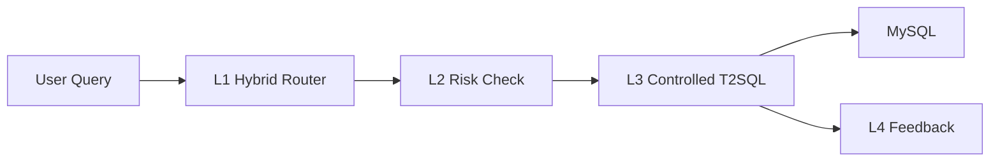

# Repository Guidelines

## ��Ŀ�ṹ��ģ����֯
- `app/`�����ķ�����루FastAPI ����� `app/main.py`��L1-L4 ·�ɡ�SQL ���롢����������DB ���ʵȣ���
- `tests/`��pytest ���ԣ�ʾ����`tests/test_time_parser.py`����
- `scripts/`�����ع��߽ű���`init_db.py`��`seed_assets.py`��`build_vector_index.py`����
- `assets/`��ָ���������������ݣ�`*.seed.json`����
- ��Ŀ¼��`pyproject.toml` �����빤�����ã�`.env.example` ����ģ�壬`uv.lock` �����ļ���

## �����������뿪������
ʹ�� `uv` ���������ִ�У�
- `uv venv` / `uv sync`���������⻷������װ������
- `uv run uvicorn app.main:app --reload --port 8000`��������� API��
- `uv run python scripts/init_db.py`����ʼ�� MySQL ���
- `uv run python scripts/seed_assets.py`������ָ��/�������ӡ�
- `uv run python scripts/build_vector_index.py`���ؽ� Chroma ����������
- `uv run pytest`�����в��ԡ�
- `uv run ruff check .`�������顣

## ������������Լ��
- Python 3.10+��
- Ruff ���ã�`line-length = 100`���� `pyproject.toml`����
- ģ���ļ�ʹ�� snake_case�������ļ�����Ϊ `test_*.py`��
- ����ʹ�����������ݽṹ�����ͣ������� Pydantic����

## ����ָ��
- ��ܣ�pytest��
- ���Է��� `tests/`���� `test_` ǰ׺������
- δ���帲�����ż�������������SQL ���ɡ�����߼�ʱ�벹����ԡ�

## �ύ��ϲ�����淶
- ��ǰ�������� Git ��ʷ���޷�ȷ�ϼ����ύ�淶��
- ���飺�ύ��Ϣ�ü�ද�ʿ�ͷ����˵��Ӱ�췶Χ��
- PR ��������ժҪ�����Է�ʽ���Լ��κ� API �����ñ��˵����

## �����밲ȫ��ʾ
- ���� `.env.example` Ϊ `.env`����д MySQL��LLM��Embedding ���á�
- ��Ҫ�ύ `.env` �е���Կ��
- `assets/` �е���������Ϊʾ�������滻Ϊʵ��ҵ��ָ�������

## 四层架构说明（L1-L4）
### 每层输入/输出示例
- L1 输入：`{"user_id":"u_001","role":"analyst","query":"上周GMV"}` → 输出：`{"metric_key":"gmv","time":"last_week","route":"rule|rag"}`
- L2 输入：`{"query":"上周GMV","role":"analyst","sql_ast":{...}}` → 输出：`{"risk_level":"low","issues":[]}`
- L3 输入：`{"intent":"metric_query","dims":["channel"],"time":"last_week"}` → 输出：`{"sql":"SELECT ..."}`
- L4 输入：`{"user_id":"u_001","query":"上周GMV","sql":"SELECT ..."}` → 输出：`{"pattern_id":123,"status":"stored"}`

### 流程图（Mermaid）

- L1 Hybrid Router：优先命中缓存与规则词典，无法命中时进入 RAG 向量召回，输出指标口径与术语匹配结果。
- L2 风险评估：先做输入与角色级别的 Pre-risk，再对生成 SQL AST 做 Post-risk 校验（敏感列、无 LIMIT 等）。
- L3 受控 Text-to-SQL：LLM 只生成 QueryPlan(JSON)，由确定性编译器生成 SQL，并执行 validate→repair 闭环。
- L4 反馈学习：将成功查询写入 `query_patterns` 用于后续检索增强；新指标不自动生效，需人工审核。

